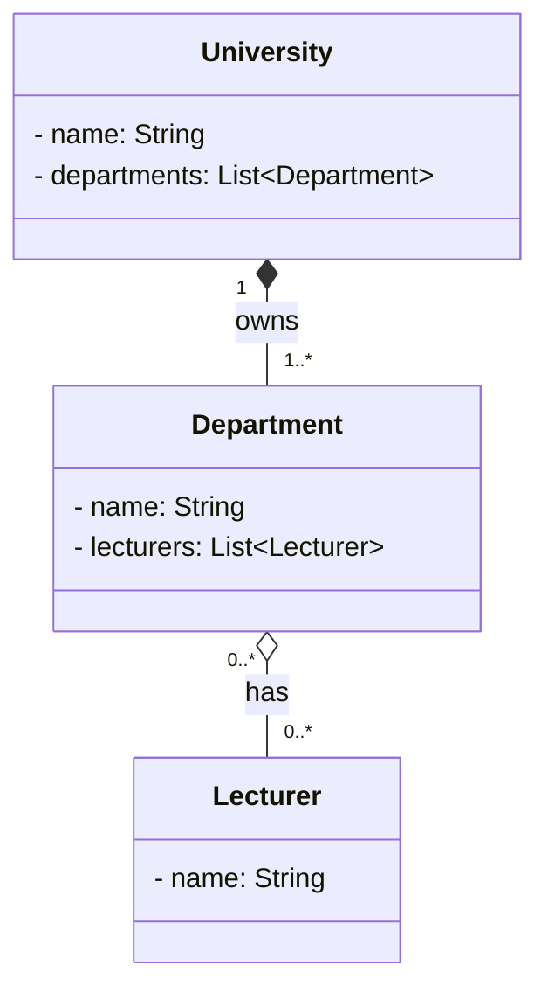
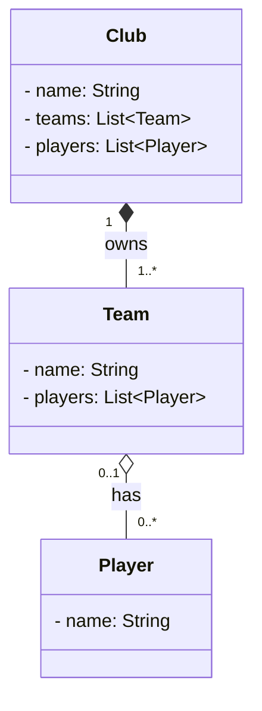

# Exercises 2 - 4

---

### Exercise 2 — University Departments
__*Answer:*__

  - *University* to *Department* is **composition:**
   A department belongs to exactly one university, and if the university closes, its departments disappear too.

  - *Department* to *Lecturer* is **aggregation:**
   A department has lecturers, but lecturers exist independently. 
   If a department is dissolved, the lecturers still exist and can move elsewhere.

  - The _0..*_ on both sides between *Department* and *Lecturer* means a department can have many lecturers, 
   and a lecturer can teach in many departments.

---

## Exercise 3 — Sports Club

__*Answer:*__

 - *Club* to *Team* is **composition:**
A team belongs to exactly one club. If the club shuts down, its teams disappear with it.

 - *Team* to *Player* is **aggregation:**
A team has players, but the players still exist if the team is disbanded. They can be reassigned, loaned, or transferred.

The multiplicity between *Team* and *Player* is:
 - One team can have many players: _0..*_
 - One player is assigned to zero or one team at a time: _0..1*_

I included *players: List<Player>* inside *Club* too because the exercise says players remain registered 
with the club even if a team is disbanded. That means the club can still know about players separately from their current team.

---

## Exercise 4 — Customer Orders

__*Answer:*__

---