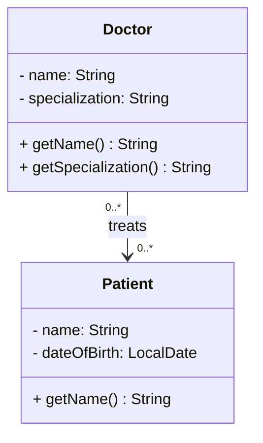
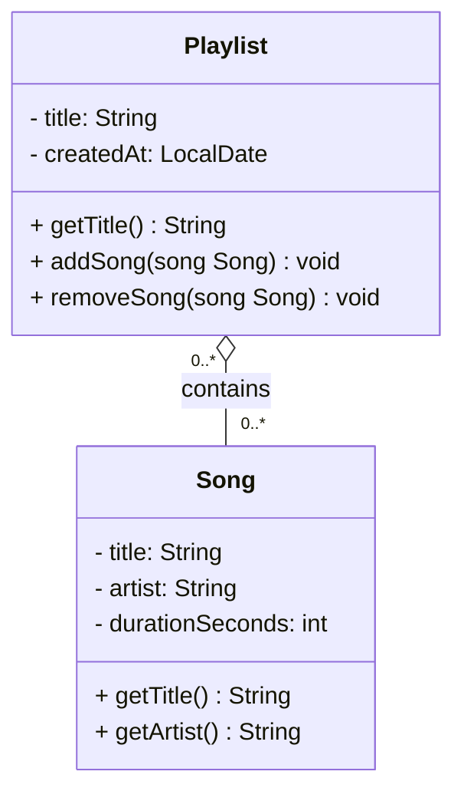
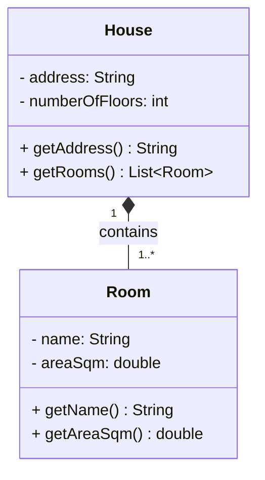

# Object Relationships — Association, Aggregation, and Composition

---

## Why Relationships Matter

In object-oriented programming, objects rarely live alone. A customer places orders. A playlist contains songs. A house has rooms. The way objects connect to each other is just as important as what they contain individually.

There are three types of relationships between objects:

- **Association** — one object knows about another
- **Aggregation** — one object holds a collection of others, but they exist independently
- **Composition** — one object owns another, and the owned object cannot exist without it

The difference between them comes down to one question:

> **If the parent is deleted, does the child disappear with it?**

---

## Association

### What it means

One object references another, but neither owns the other. Both exist completely independently. Removing one has no effect on the existence of the other.

### The question to ask

> If A is removed from the system, does B disappear?
> If B is removed, does A disappear?

If the answer is **no** to both — it is an association.

### Example — Doctor and Patient

A doctor treats patients. A doctor can have many patients, and a patient can see many doctors over time. If a doctor retires and is removed from the system, the patients still exist. If a patient is discharged, the doctor still exists and continues treating others.

Neither creates the other. Neither owns the other. They are simply linked.



### In code

`Doctor` holds a `List<Patient>`. The patients are not created by the doctor — they exist in the system independently. The doctor just holds references to them.

```java
class Doctor {
    private List<Patient> patients = new ArrayList<>();

    public void addPatient(Patient patient) {
        patients.add(patient);
    }
}
```

---

## Aggregation

### What it means

One object holds a collection of other objects, but the collected objects can exist on their own. The parent groups them — it does not own them. If the parent disappears, the children survive and can belong to something else.

### The question to ask

> If the parent is removed, do the children disappear with it?

If the answer is **no — the children survive** — it is aggregation.

### Example — Playlist and Song

A playlist contains songs. If you delete the playlist, the songs still exist on the platform — they can appear in other playlists, be searched, and played. Songs exist before any playlist is created and remain after it is deleted.

The playlist groups the songs. It does not own them.



### In code

`Playlist` holds a `List<Song>`, but `Song` objects are created and managed elsewhere. The playlist receives songs that already exist — it does not create them.

```java
class Playlist {
    private List<Song> songs = new ArrayList<>();

    public void addSong(Song song) {
        songs.add(song);
    }
}
```

---

## Composition

### What it means

One object owns another completely. The owned object is created by the parent and has no meaningful existence outside of it. When the parent is destroyed, the child is destroyed with it.

### The question to ask

> If the parent is removed, does the child disappear with it?

If the answer is **yes — the child has no meaning without the parent** — it is composition.

### Example — House and Room

A house is made up of rooms. Rooms are physically part of the house — they do not exist independently. If the house is demolished, the rooms are gone. There is no such thing as "a room that belongs to no house" — a room only exists as part of a specific house.



### In code

`House` creates its `Room` objects directly. Rooms are not passed in from outside — they are born with the house and die with it.

```java
class House {
    private List<Room> rooms = new ArrayList<>();

    public House(String address) {
        this.address = address;
        rooms.add(new Room("Living Room", 30.0));
        rooms.add(new Room("Bedroom", 20.0));
        rooms.add(new Room("Kitchen", 15.0));
    }
}
```

---

## How to Choose

| Question | Relationship |
|---|---|
| Both objects exist independently and just reference each other | Association `-->` |
| The parent holds a collection, but children survive if the parent is removed | Aggregation `o--` |
| The child only exists because the parent created it — no life outside it | Composition `*--` |

### The one test

**Delete the parent. What happens to the child?**

- The child still exists fully on its own → **Association**
- The child still exists but now belongs to nothing → **Aggregation**
- The child ceases to exist — it was part of the parent → **Composition**

---
